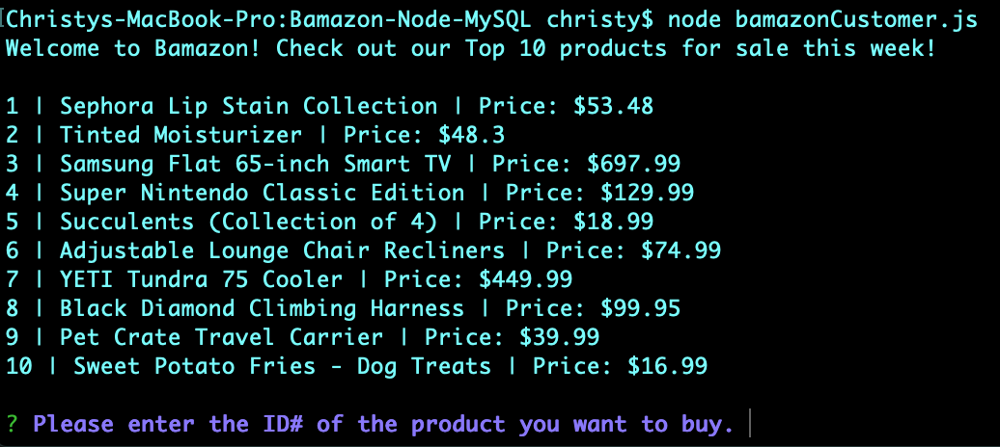
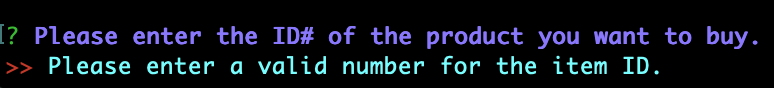
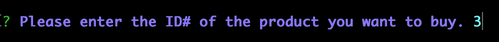
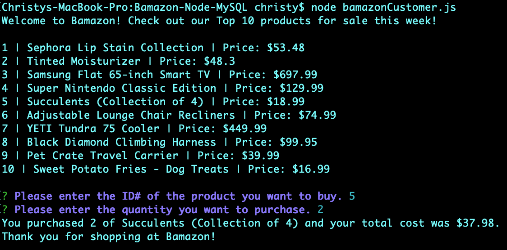
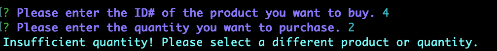
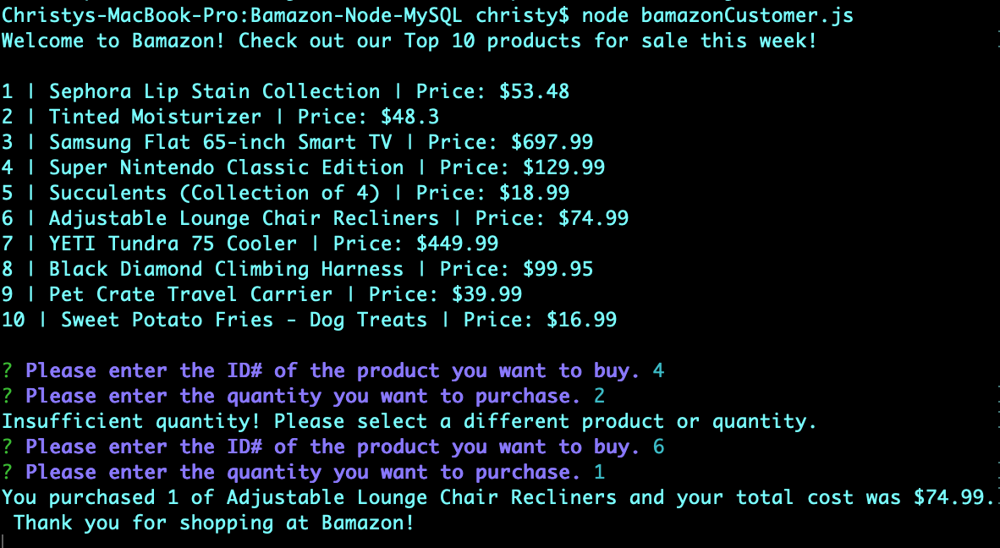

# Bamazon-Node-MySQL

## What is Bamazon? ##

Bamazon is an Amazon-like storefront using MySQL & Node. The app will take in orders from customers and deplete stock from the store's inventory. Requiring the MySQL and Inquirer npm packages, the app will use & store data.

## Instructions ##

1. Create a MySQL database called bamazon, then create a Table inside database called products and enter data.

2. Create a .env file to store the following information to make a connection
- host='Database address such as localhost'
- port='Port number goes here'
- user='Username goes here'
- password='Database password goes here'
- database='Database name being used'

3. Create Node app called bamazonCustomer.js

4. Before running any of the node files please run `npm init` for package.json and `npm install` for node modules in the command line.

## Visual for app ##

Welcome screen with products and prompt

Screen validating input

Successful purchase screen

If store does not have enough quantity of product for purchase, the app lets the customer know to choose another product or quantity.

App effectively completes the updated request.

### Thanks for visiting and enjoy the app! ###